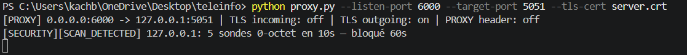
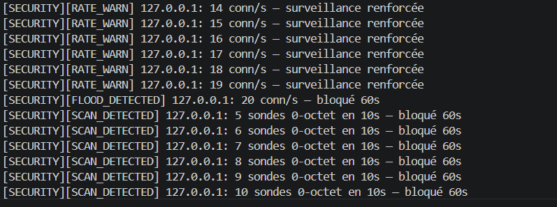
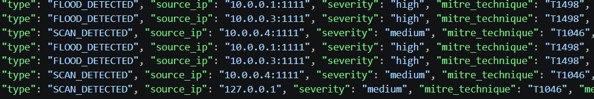
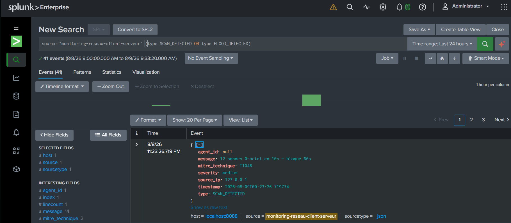
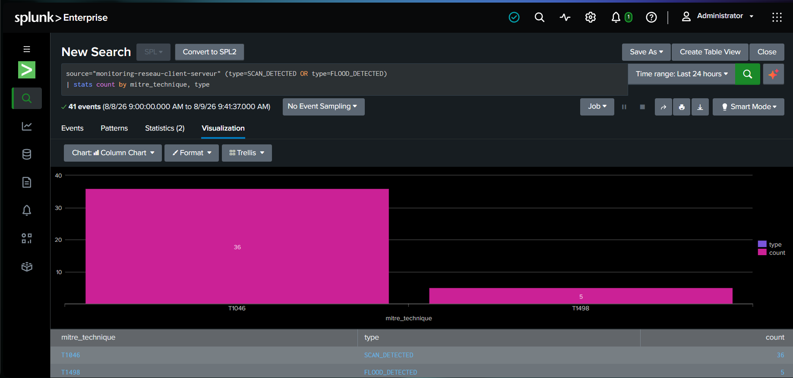
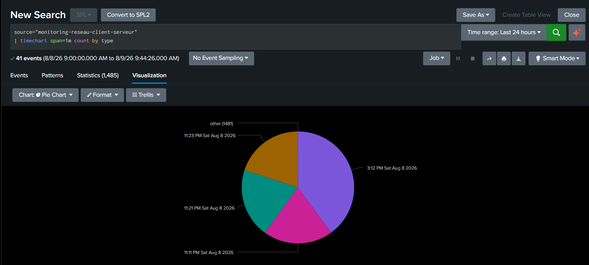

# 🛡️ Monitoring Réseau Client-Serveur — Proxy TCP de détection scan/flood + Splunk


🇫🇷 Français | [🇬🇧 English version](README.en.md)

> **TL;DR (EN):** A lightweight TCP proxy that sits in front of any service, detects port scans and connection floods in real time, classifies them against **MITRE ATT&CK** (T1046, T1498), auto-blocks offending IPs (fail-open on internal errors), and forwards every event to **Splunk** via HTTP Event Collector. Ships with Docker Compose, a Flask/Chart.js monitoring dashboard for the underlying client-server layer, and 28 automated tests.

Projet réalisé par **Azza Kachbouri** et **Dhia Selmi**.

---

## 📋 Table des matières

- [1. Le projet en un coup d'œil](#1-le-projet-en-un-coup-dœil)
- [2. Démonstration](#2-démonstration)
- [3. Architecture](#3-architecture)
- [4. Détection d'anomalies — scan vs flood](#4-détection-danomalies--scan-vs-flood)
- [5. Forwarder Splunk (HEC)](#5-forwarder-splunk-hec)
- [6. Installation et lancement](#6-installation-et-lancement)
- [7. Le monitoring client-serveur (couche historique)](#7-le-monitoring-client-serveur-couche-historique)
- [8. Tests](#8-tests)
- [9. Structure du projet](#9-structure-du-projet)
- [10. Ce qui reste à faire](#10-ce-qui-reste-à-faire)
- [11. Auteurs](#11-auteurs)

---

## 1. Le projet en un coup d'œil

Le projet a démarré comme un TP réseaux classique (monitoring client-serveur TCP/UDP), puis a été repositionné vers quelque chose de plus proche d'un vrai outil de sécurité réseau :

**Un proxy TCP attachable à n'importe quel service**, qui :

- 🔍 **Détecte** les scans de service (connexions courtes, 0 octet — signature type `nmap -sT`) et les floods/DoS (débit anormal de connexions)
- 🏷️ **Classe** chaque anomalie selon **MITRE ATT&CK** (T1046 – Network Service Discovery, T1498 – Network Denial of Service)
- 🚫 **Bloque automatiquement** l'IP source, avec un comportement **fail-open** : si le détecteur plante, le trafic continue de passer plutôt que de couper un client légitime
- 📤 **Envoie en temps réel** chaque événement vers **Splunk** (HTTP Event Collector), sans perte ni doublon même si Splunk est temporairement injoignable
- 🔒 Supporte **TLS** de bout en bout (client → proxy → serveur)
- 🐳 Se déploie entièrement via **Docker Compose** (proxy, serveur, dashboard, Splunk, forwarder)

Le tout est testé automatiquement (28 tests au total) et conçu pour être 100% gratuit à faire tourner en local.

---

## 2. Démonstration

### Détection en direct

**Scan détecté** (`SCAN_DETECTED`, T1046) — plusieurs sondes 0-octet depuis la même IP :



**Flood détecté** (`FLOOD_DETECTED`, T1498) — débit de connexions anormal :



### Événements structurés

Chaque événement est écrit en JSON (`events.jsonl`) avec sa technique MITRE ATT&CK :



### Dans Splunk

Recherche des événements de sécurité forwardés en temps réel :



Répartition par technique MITRE ATT&CK :



Timeline des détections :



### Reproduire cette démo toi-même

```bash
# Terminal 1
python server.py

# Terminal 2
python proxy.py --listen-port 6000 --target-port 5051 --tls-cert server.crt

# Terminal 3 — simuler un scan
python scripts/simulate_scan.py --port 6000 --count 6 --delay 0.2

# Terminal 3 — simuler un flood (baisse le seuil si ta machine est rapide, sinon ça ne se déclenche pas)
python scripts/simulate_flood.py --port 6000 --count 150
```

---

## 3. Architecture

```
                 ┌──────────────┐        ┌──────────────┐
  Client/Agent ──▶│  proxy.py    │───────▶│  server.py    │
  (ou nmap, etc.) │  (TCP proxy) │  TLS   │  (TCP/UDP)    │
                 └──────┬───────┘        └──────────────┘
                        │ détecte / bloque
                        ▼
                 ┌──────────────┐
                 │security_core │  → events.jsonl (MITRE ATT&CK)
                 └──────┬───────┘
                        ▼
                 ┌──────────────┐        ┌──────────────┐
                 │splunk_forward│───────▶│   Splunk     │
                 │  (HEC)       │  HTTPS │  (dashboards) │
                 └──────────────┘        └──────────────┘
```

Le proxy est **agnostique du service protégé** : il relaie n'importe quel trafic TCP tout en l'observant, sans dépendre du protocole applicatif.

---

## 4. Détection d'anomalies — scan vs flood

Un scan et un flood n'ont pas la même signature réseau, donc deux mécanismes distincts :

|                      | Scan (T1046)                                         | Flood (T1498)                                 |
| -------------------- | ---------------------------------------------------- | --------------------------------------------- |
| **Signature**        | Connexion très courte (< 0.5s), **0 octet** transmis | Débit anormal de nouvelles connexions/seconde |
| **Détecté**          | À la fermeture de connexion                          | À l'ouverture de connexion                    |
| **Seuil par défaut** | 5 sondes en 10s                                      | 100 connexions/s                              |
| **Action**           | Blocage IP 60s                                       | Blocage IP 60s                                |

Tous les seuils sont externalisés dans `config.py` / `.env` — rien n'est en dur dans le code.

**Fail-open :** chaque appel au détecteur depuis `proxy.py` est enveloppé dans un `try/except`. Si `security_core.py` lève une exception, le trafic continue de passer plutôt que d'être bloqué par erreur — un bug de détection ne doit jamais devenir un déni de service pour des utilisateurs légitimes.

---

## 5. Forwarder Splunk (HEC)

`splunk_forwarder.py` lit `events.jsonl` en continu (polling léger, pas de dépendance directe avec le proxy) et envoie chaque nouvel événement à Splunk via HTTP Event Collector.

- **Zéro perte, zéro doublon** : l'offset de lecture n'avance que si Splunk confirme la réception (HTTP 200 + `code: 0`). Si Splunk est injoignable, retry au prochain passage.
- **Batché** : jusqu'à 50 événements par requête HTTP.

### Requêtes SPL utiles

```spl
# Tous les événements de sécurité
source="monitoring-reseau-client-serveur"

# Répartition par technique MITRE
source="monitoring-reseau-client-serveur" (type=SCAN_DETECTED OR type=FLOOD_DETECTED)
| stats count by mitre_technique, type

# Timeline
source="monitoring-reseau-client-serveur" | timechart span=1m count by type

# Top IPs bloquées
source="monitoring-reseau-client-serveur" (type=SCAN_DETECTED OR type=FLOOD_DETECTED)
| stats count by source_ip, type | sort -count
```

---

## 6. Installation et lancement

### Option A — Docker Compose (recommandé, tout-en-un)

```bash
copy .env.example .env   # puis renseigne AGENT_AUTH_TOKEN, SPLUNK_PASSWORD, SPLUNK_HEC_TOKEN
docker compose up --build
```

| Service              | URL                    |
| -------------------- | ---------------------- |
| Dashboard monitoring | http://localhost:8000  |
| Serveur TCP/UDP      | localhost:5051         |
| Proxy (TLS)          | localhost:6000         |
| Splunk Web           | http://localhost:8001  |
| Splunk HEC           | https://localhost:8088 |

### Option B — Manuel

```bash
pip install -r requirements.txt
python generate_cert.py          # génère server.crt / server.key
python server.py                 # terminal 1
python proxy.py --listen-port 6000 --target-port 5051 --tls-cert server.crt   # terminal 2
python splunk_forwarder.py       # terminal 3 (nécessite SPLUNK_HEC_TOKEN dans .env)
```

---

## 7. Le monitoring client-serveur (couche historique)

Le proxy protège un serveur de monitoring TCP/UDP développé au départ comme TP réseaux : les agents (`client.py` / `client_simple.py`) reportent périodiquement CPU/RAM au serveur, qui agrège et expose un dashboard temps réel (Flask + Chart.js sur le port 8000).

- Protocole : `HELLO` / `REPORT` / `HEALTH` / `BYE`, TCP et UDP simultanément
- Auto-cleanup des agents inactifs (fenêtre de 3×T)
- Alertes automatiques : `CPU_HIGH`, `AGENT_INACTIVE`, `ERROR_STORM`
- Export CSV des statistiques

---

## 8. Tests

```bash
python test_suite.py           # 17 tests — couche monitoring client-serveur
python test_security_core.py   # 7 tests — détecteur scan/flood
python test_splunk_forwarder.py # 7 tests — forwarder Splunk (mocké, pas besoin de Splunk)
```

**28 tests au total**, tous automatisés. `test_security_core.py` et `test_splunk_forwarder.py` ne nécessitent ni serveur ni Splunk réel pour tourner — la logique est testée isolément.

> ⚠️ `test_suite.py` nécessite `server.py` démarré au préalable.

---

## 9. Structure du projet

```
.
├── server.py                # Serveur TCP + UDP (monitoring)
├── client.py / client_simple.py   # Agents
├── flask_api.py              # Dashboard web
├── proxy.py                  # Proxy TCP attachable — détecte, bloque, relaie
├── security_core.py          # Détecteur scan/flood + tags MITRE ATT&CK
├── splunk_forwarder.py       # Forwarder events.jsonl → Splunk HEC
├── config.py                 # Toute la configuration (seuils, tokens, URLs)
├── scripts/
│   ├── simulate_scan.py      # Simule un scan pour la démo
│   └── simulate_flood.py     # Simule un flood pour la démo
├── test_suite.py             # Tests monitoring (17)
├── test_security_core.py     # Tests détecteur (7)
├── test_splunk_forwarder.py  # Tests forwarder (7)
├── docker-compose.yml
├── Dockerfile
└── docs/screenshots/         # Captures pour ce README
```

---

## 10. Ce qui reste à faire

Honnêteté d'abord — ce projet est solide mais pas terminé :

- [ ] Tester le proxy contre un service autre que le nôtre (généralisation complète)

---

## 11. Auteurs

**Azza Kachbouri** — détecteur d'anomalies (scan/flood, tags MITRE ATT&CK), forwarder Splunk
**Dhia Selmi** — proxy TCP, authentification, TLS, Docker
